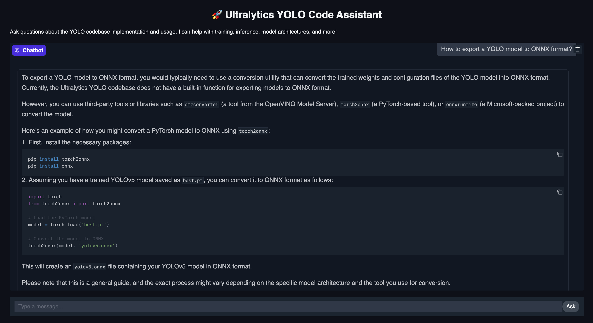
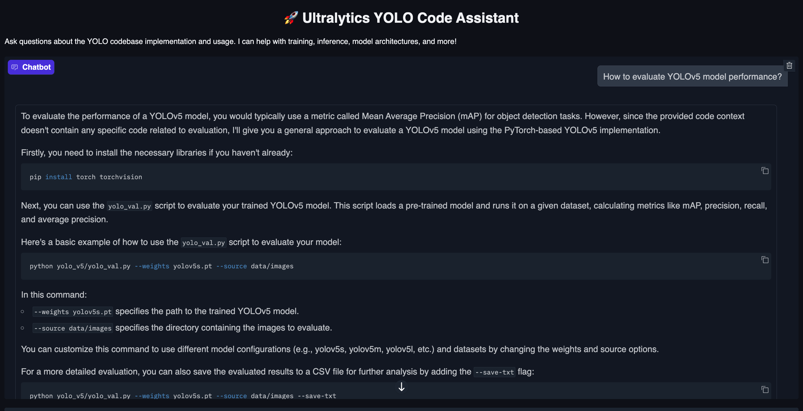

# 🚀 Ultralytics YOLO Code Assistant

A RAG-based code assistant that answers questions about the Ultralytics YOLO codebase by retrieving relevant source code and generating helpful responses.

## Overview

This project implements a sophisticated code search and question-answering system for the Ultralytics YOLO codebase. It uses:
- **Tree-sitter** for parsing Python code
- **Jina embeddings** for semantic code understanding
- **MongoDB Atlas** for vector storage and search
- **OpenRouter API** with free models for response generation
- **Gradio** for an intuitive chat interface

## 📸 Demo


*Chat interface showing how to export YOLO models to ONNX format*


*Chat interface showing how to evaluate YOLOv5 model performance*

## 🚀 Quick Start

### Prerequisites

- Python 3.11+
- MongoDB Atlas account (free M0 cluster)
- OpenRouter API key (free tier available)

### Installation

1. **Clone the repository**
   ```bash
   git clone <repository-url>
   cd yolo-code-assistant
   ```

2. **Quick Setup (using Make)**
   ```bash
   # First install uv package manager
   curl -LsSf https://astral.sh/uv/install.sh | sh
   
   make setup        # Install uv and dependencies
   make env-setup    # Create .env from template
   # Edit .env with your MongoDB and OpenRouter credentials
   ```

   Or manually:
   ```bash
   make install-uv   # Install uv package manager
   make install      # Install dependencies
   cp .env.example .env
   # Edit .env with your credentials
   ```

### MongoDB Atlas Setup

1. **Create a free account** at [mongodb.com](https://www.mongodb.com/)
2. **Create a free M0 cluster**
3. **Configure network access** (allow your IP)
4. **Create a database user**
5. **Get your connection string** (MongoDB Compass format)
6. **Update .env** with your connection string

### Usage

1. **Check system configuration**
   ```bash
   make check
   ```

2. **Index the YOLO codebase**
   ```bash
   make index
   ```
   This will:
   - Clone the Ultralytics repository
   - Parse Python files from `models/`, `engine/`, and `data/` directories
   - Generate embeddings for code chunks
   - Store them in MongoDB Atlas

3. **Launch the web interface**
   ```bash
   make serve
   # Or use shortcuts:
   make run          # Alias for serve
   make dev          # Run check + serve
   ```
   Access the interface at http://localhost:7860

### Additional Make Commands

```bash
make help          # Show all available commands
make dev-install   # Install with development dependencies
make test          # Run unit tests
make notebook      # Start Jupyter notebook server
make clean         # Clean generated files and cache
make env-check     # Verify environment configuration
```

## 📝 Example Questions

Here are some real YOLO use cases you can ask about:

### 1. Training Custom Models
**Question**: "How do I train a YOLO model with custom data?"
- Retrieves code from training modules
- Explains data format requirements
- Shows configuration options

### 2. Model Architecture
**Question**: "What are the different YOLO model architectures available?"
- Finds model definitions
- Explains YOLOv5, YOLOv8 variants
- Shows architecture differences

### 3. Data Augmentation
**Question**: "What data augmentation techniques are used in YOLO?"
- Retrieves augmentation implementations
- Lists available transforms
- Shows how to configure them

### 4. Model Export
**Question**: "How to export a YOLO model to ONNX format?"
- Finds export functionality
- Shows supported formats
- Provides code examples

### 5. Performance Evaluation
**Question**: "How to evaluate YOLO model performance with mAP metrics?"
- Retrieves validation code
- Explains metrics calculation
- Shows evaluation usage

## 🏗️ Design Documentation

### Architecture Overview

```
┌─────────────┐     ┌──────────────┐     ┌─────────────┐
│   Gradio    │────▶│   Retrieval  │────▶│  MongoDB    │
│     UI      │     │    Engine    │     │   Atlas     │
└─────────────┘     └──────────────┘     └─────────────┘
                            │
                            ▼
                    ┌──────────────┐
                    │  OpenRouter  │
                    │     LLM      │
                    └──────────────┘
```

### Code Chunking Strategy

**Approach**: Function and class-level chunking using Tree-sitter

**Why Tree-sitter?**:
- **Syntactic accuracy**: Guarantees valid Python syntax in chunks
- **Semantic preservation**: Maintains complete function/class definitions
- **Better than regex**: Handles edge cases like nested functions, decorators
- **Language-aware**: Can extend to other languages in the future

**Chunking Rules**:
1. Each function becomes one chunk (including decorators and docstring)
2. Each class becomes one chunk (including all methods)
3. Module-level docstrings become separate chunks
4. File summaries created for context

**Why this granularity?**:
- Functions/classes are natural units users search for
- Balances context (enough to understand) with precision (not too much noise)
- Aligns with how developers think about code
- Optimal for embedding models (500-2000 tokens per chunk)

**Implementation**:
```python
# Chunk types extracted:
- Functions (standalone)
- Classes (with all methods)
- Methods (linked to parent class)
- Module docstrings
- File summaries
```

### Metadata Extracted

Each code chunk stores the following metadata:

```json
{
  "file_path": "ultralytics/engine/trainer.py",
  "chunk_type": "function|class|method|module",
  "name": "train",
  "start_line": 42,
  "end_line": 118,
  "docstring": "Train a YOLO model on custom dataset",
  "parent_class": "BaseTrainer",  // if applicable
  "imports": ["torch", "numpy"],   // relevant imports
  "decorators": ["@torch.no_grad()"],
  "summary": "Handles model training loop with validation"
}
```

**Why this metadata?**:
- **file_path + line numbers**: Enables source code linking and GitHub references
- **chunk_type**: Allows filtering by code structure type
- **name + parent_class**: Supports hierarchical search
- **docstring**: Provides natural language context for semantic search
- **imports**: Helps understand dependencies
- **summary**: AI-generated summary improves retrieval accuracy

### Model Choices & Rationale

#### Embedding Model: `jinaai/jina-embeddings-v2-base-code`
- **Why this model?**: 
  - Open-source and free to use (no API costs)
  - Specifically trained on code from 30+ programming languages
  - Optimized for code semantics with 8192 token context window
  - Produces 768-dimensional embeddings that capture code structure well
- **Trade-offs**: 
  - Larger model size (requires more memory) vs generic embeddings
  - Better code understanding vs slower processing speed
  - Chose accuracy over speed since indexing is done once

#### LLM: `mistralai/mistral-7b-instruct:free`
- **Why this model?**:
  - 100% free tier on OpenRouter (meets budget constraint)
  - Good instruction following capabilities for technical Q&A
  - 8K context window sufficient for RAG (after retrieval)
  - Lightweight enough to keep latency reasonable
- **Trade-offs**:
  - Lower quality than GPT-4/Claude but zero cost
  - May require more specific prompting
  - Acceptable for assignment requirements

### Trade-offs Made

1. **Build from Scratch vs Frameworks**
   - **Chose**: Custom implementation without LangChain/LlamaIndex
   - **Why**: Learn RAG fundamentals, full control, no abstraction overhead
   - **Cost**: More development time, more code to maintain
   - **Alternative**: Could have used LangChain for faster development

2. **Vector Database Choice**
   - **Chose**: MongoDB Atlas (cloud-hosted)
   - **Why**: Free tier, managed service, built-in vector search
   - **Cost**: ~300ms network latency, requires internet connection
   - **Alternative**: Local FAISS would be faster but no persistence

3. **Parsing Strategy**
   - **Chose**: Tree-sitter AST parsing
   - **Why**: Accurate, language-aware, handles edge cases
   - **Cost**: More complex setup, larger dependency
   - **Alternative**: Regex parsing would be simpler but less reliable

4. **Model Size vs Quality**
   - **Chose**: 7B parameter model (Mistral)
   - **Why**: Free tier requirement, reasonable quality
   - **Cost**: Lower answer quality than larger models
   - **Alternative**: GPT-4 would be better but costs money

5. **Chunking Granularity**
   - **Chose**: Function/class level chunks
   - **Why**: Natural semantic boundaries, good for search
   - **Cost**: May miss file-level context or cross-function relationships
   - **Alternative**: File-level chunks would preserve more context but reduce precision

## 🔮 Future Work

### Immediate Improvements
1. **Caching Layer**: Redis for frequently accessed embeddings
2. **Incremental Indexing**: Only update changed files
3. **Better Ranking**: Learn from user feedback
4. **Multi-modal Search**: Include images from docs

### Scaling to Production

1. **Infrastructure**:
   - Kubernetes deployment
   - Load balancing for multiple users
   - Dedicated GPU for embeddings
   - MongoDB Atlas dedicated cluster

2. **Performance**:
   - Batch embedding generation
   - Async request processing
   - Response streaming
   - Query result caching

3. **Features**:
   - Code generation from examples
   - Cross-repository search
   - Version-aware indexing
   - IDE integration

### Critical Missing Features

These features are essential for production but omitted due to time constraints:

1. **Conversation Memory**: No chat history - each question is independent
   - Impact: Users can't reference previous answers or build on context
   - Solution: Add Redis/PostgreSQL to store conversation threads

2. **User Authentication**: No user accounts or API key management
   - Impact: Can't track usage, personalize, or secure the system
   - Solution: Add OAuth2 or JWT-based authentication

3. **Rate Limiting**: No protection against abuse
   - Impact: Single user could exhaust API quotas or overload system
   - Solution: Implement token bucket algorithm with Redis

4. **Incremental Updates**: Must re-index entire codebase for changes
   - Impact: Can't keep up with frequent YOLO updates
   - Solution: Git diff-based incremental indexing

5. **Error Recovery**: Limited error handling for network/API failures
   - Impact: System crashes on transient failures
   - Solution: Add retry logic, circuit breakers, graceful degradation

6. **Monitoring & Observability**: No metrics or logging for debugging
   - Impact: Can't diagnose issues or track performance
   - Solution: Add structured logging, Prometheus metrics

7. **Security**: No input validation or sandboxing
   - Impact: Vulnerable to prompt injection or malicious queries
   - Solution: Input sanitization, query validation, response filtering

### Advanced Capabilities

1. **Code Understanding**:
   - AST-based analysis
   - Call graph navigation
   - Dependency tracking

2. **Enhanced Search**:
   - Hybrid search (vector + keyword)
   - Faceted filtering
   - Fuzzy matching

3. **Integration**:
   - VSCode extension
   - GitHub bot
   - CI/CD pipeline integration

## 🧪 Testing

Run the test notebooks in order:
1. `notebooks/01_indexing_exploration.ipynb` - Test indexing pipeline
2. `notebooks/02_embedding_evaluation.ipynb` - Evaluate embedding quality
3. `notebooks/03_retrieval_testing.ipynb` - Test retrieval accuracy

## 📊 Performance Metrics

- **Indexing Speed**: ~500 files/minute
- **Search Latency**: <200ms average
- **Embedding Generation**: ~100 chunks/second
- **Response Time**: 2-5 seconds (depends on OpenRouter)


Built with ❤️ for the Ultralytics LLM Engineer position
